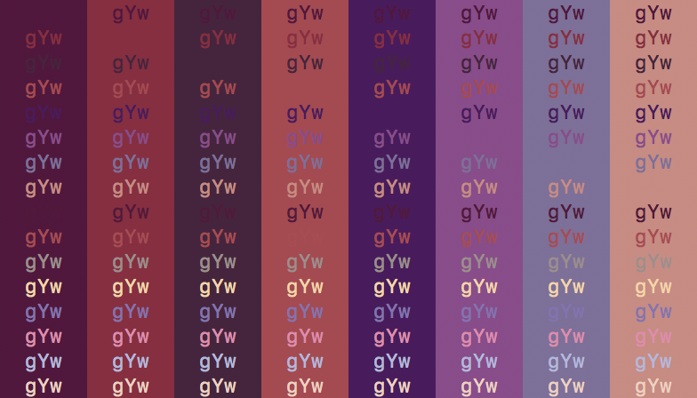

imgscheme
=========

Generates terminal color schemes from images and existing color schemes

Building
--------

    go build

Usage
-----

    imgscheme [-N color] file

imgscheme generates a terminal color scheme from an image file. It attempts to
make the generated colors correspond to prominent colors in the image, and also
close to the corresponding colors in a base color scheme. If file is absent,
imgscheme reads from the standard input. The colors in the base scheme can be
set using numeric flags corresponding to the 16 ANSI colors (0-15) as hex
triplets /[0-9a-f]{6}/ The generated colors will be output in order as hex
triplets.

Examples
--------

### Lena

